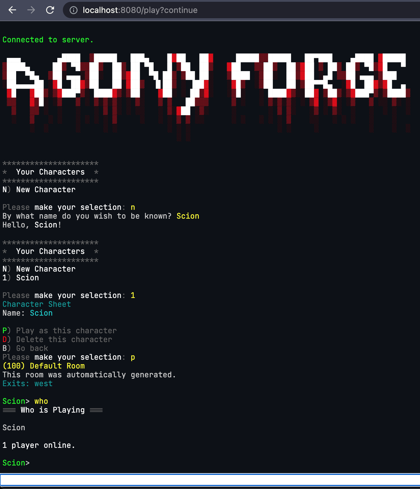

[](https://discord.gg/6DHKrMJCJE)

# Agony Forge
**Build a game, not an antique.**  
Agony Forge is a framework for building web based Multi User Domains, or MUDs. Think Spring Boot for building a MUD. It's free and open source. The main goal for Agony Forge is to make it easy for retro gaming enthusiasts to bring the feeling of MUDs back in the 90s forward to the modern day.
## Core Module
Agony Forge provides a core module that handles security, session management, server clustering, and WebSocket transport for connections between players' browsers and the MUD server. It also provides a small set of standard objects that can be pulled in as a dependency via Gradle or Maven and used to build a standard Spring Boot application.

The core module provides the basic features that most any MUD would need:
* Framework for interpreting user commands
* Simple menuing system
* Basic timers
* Messages from the server to clients
* Colors
* Flexible dice rolling
  
## Demo MUD
The second module is a demo MUD to demonstrate the framework's capabilities and to guide development in useful directions. At the moment it is in early development and not hosted online, but if you're feeling adventurous you can clone it and try it out on your own computer. It's still a little challenging to set up, but this process will get easier soon.

```bash
$ git clone git@github.com:scionaltera/agonyforge.git
$ cd agonyforge
$ cp mud.EXAMPLE.env mud.env
# set up an OAuth2 application in GitHub, see wiki for details!
$ ./gradlew clean build
$ docker-compose up
# go to http://localhost:8080 to see the MUD!
```

Please check the [Wiki](https://github.com/scionaltera/agonyforge/wiki/How-to-Develop) for much more detailed setup instructions. If you get stuck, feel free to ask for help on our Discord by clicking the badge at the top of this README.

After it matures a little, I am excited to get it [online](https://agonyforge.com) and let people play it there. Here's what it looks like.



## Optional Modules
As the demo MUD is built up, other optional modules will also become available. The optional modules will provide additional functionality but the core module will not depend on them, similar to the way you can pick and choose which modules to use in Spring Boot.

### DynamoDB
The DynamoDB based persistence layer is for storing characters, rooms, and other game data in DynamoDB.

## History
Agony Forge is not an old project, having just started in November 2022, but it has a long history. I've been writing code for over 20 years, and I've been working on 100% from-scratch MUD codebases for nearly that long. After many years of writing and rewriting due to changing technologies and changing ideas, it occurred to me that separating the framework from the game was the best path forward. That way the different games I'd like to write could all share the same foundation, and your game could too.
